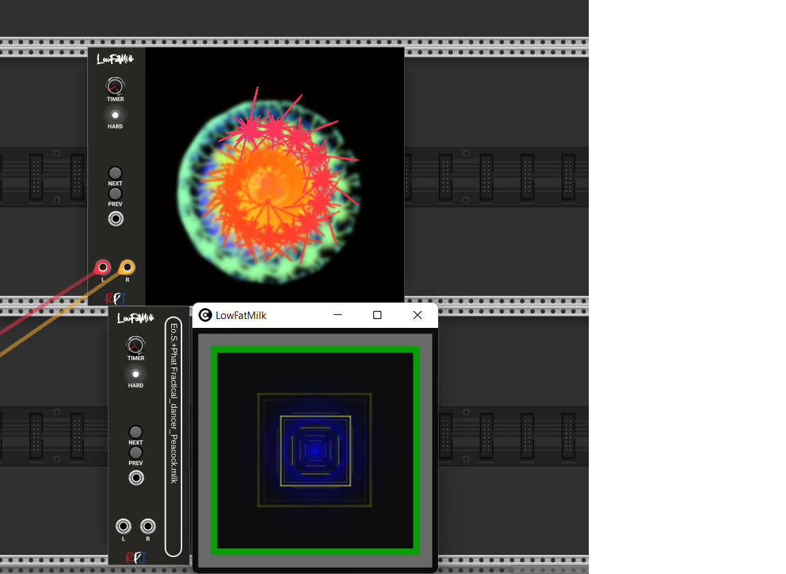

# LowFatMilk (LFM) 

Experience psychedelic and mesmerizing visuals by transforming music into equations that render into a limitless array of user-contributed visualizations.

Its purpose in life is to read audio input and to produce mesmerizing visuals, detecting tempo, and rendering advanced equations into a limitless array of user-contributed visualizations.

LowFatMilk embeds projectM, an open-source project that reimplements the esteemed Winamp Milkdrop by Geiss in a more modern, cross-platform reusable library and can be downloaded from <a href="https://github.com/projectM-visualizer/projectm">here<a>. The sources can also be requested by sending an email to robert.kock@gmail.com.

LowFatMilk comes in two versions, an embedded widget and a seperate windo version that can be dragged onto a seperate monitor.

