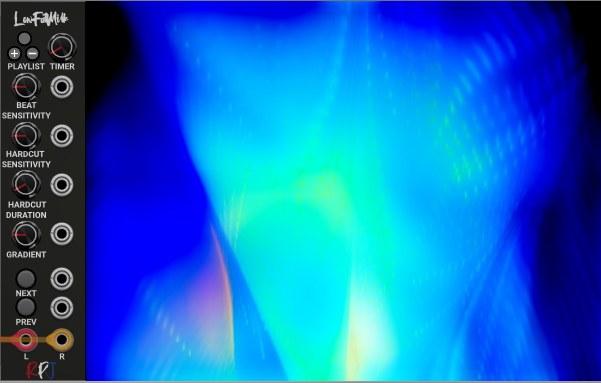

# LowFatMilk (LFM) 

Experience psychedelic and mesmerizing visuals by transforming music into equations that render into a limitless array of user-contributed visualizations.

Its purpose in life is to read audio input and to produce mesmerizing visuals, detecting tempo, and rendering advanced equations into a limitless array of user-contributed visualizations.

LowFatMilk embeds projectM, an open-source project that reimplements the esteemed Winamp Milkdrop by Geiss in a more modern, cross-platform reusable library and can be downloaded from <a href="https://github.com/projectM-visualizer/projectm">here</a>. The sources can also be requested by sending an email to robert.kock@gmail.com.

## Modules

LowFatMilk comes in two versions, an embedded widget and a seperate windowed version that can be dragged around on the screen, but also onto a seperate monitor.

  

Above is the embedded version. This version is a module and the display is sticked to the module. You can increase the size of the display (resize the window). 
By rightclicking the module you will get the option to change specific settings of the module that will control the rendering and also gives you an option to search in your list of available presets.

  

The windowed version has similar functionalities as the embedded version, but a major difference is that the display is not sticked to the module but can be dragged to wherever you want it to go. It can even go to a different monitor, if you have multiple monitors installed in your setup.

## Menu

The menu shown here offers different options that let you control the module. We will explain each option below.

  

### Cycle through visuals
Right clicking the module gives you the option to enable or disable Cycle through visuals. If this is enabled the module will automatically jump to another visual based on timer and hardcut settings. The time it stays with a visual can for example be set by the timer knob on the module. 

### Window always on top
The windowed version has the option to have the window always on top. This behaviour depends a bit on which platform you are.

### No Frames
The windows version has the option to show the window with or without frames. 

### Hardcut Enabled
A hard cut is a beat-induced immediate transition to the next visual that might happen before the visual display duration is reached. Also see Hard Cut Duration and Hard Cut Sensitivity to fine-tune the behaviour. **Cycle through visuals needs to be enabled for this to work.**

### Aspectcorrection Enabled
Enables or disables aspect ratio correction in visuals that support it. This sets a flag visuals can use to aspect-correct rendered shapes, which otherwise would be distorted if the window display isn't exactly square. This is generally used to make shapes not appear stretched, e.g. circles or squares not being squished in one direction.

### Case sensitive Visual Preset Search
This setting is used for the search option. If this is enabled the search will take place Case sensitive (so it will make difference between lowercase and uppercase).

### Visuals
Below it one can see the list of visuals that are available. The list can be huge, and to make it easier to navigate to the right visual a searchbox is available where you can type to find the desired visual.

  

## Playlists
The latest version of LFM gives you the opportunity to create lists with visuals that you like, using the VCV preset functionality.

The modules now have a button at the top which will become red if you press it. When pressed/active/red , the module is in playlist mode and will play your created list. When off, it will play the default list that contains the thousands of visuals.

  
&nbsp; &nbsp; &nbsp; &nbsp;
  

When you are not in playlist mode, you can add visuals to your list by pressing the + button when a visual is playing that you like. A visual can only be added once.

When in playlist mode, you can remove a visual from your playlist by pressing the - button.

You can save and load lists by using the standard VCV Rack load and save preset lists in the module menu, which is standard vcv functionality.

## Knobs, Buttons and Jacks

### Timer
With the timer knob you can set the time that the preset will stay active when the menu option is set to cycle through presets. The time can vary between 0 and 300 seconds. Cycle through presets needs to be enabled for this to work.

### Beat sensitivity
This knob is to control the beat sensitivity thatvaries between 0 and 5. Beat Sensitivity impacts how reactive your visualizations are to volume, bass, mid-range, and treble. Range: 0 - 5 (from "dead" to VERY reactive). It is used by most presets to perform on-beat actions like pulsing or changing rotation.

### Hard cut sensitivity
Beat sensitivity value to perform a "hard cut". It will be performed only after the number of seconds set in Hard Cut Duration have passed. Only used if hard cuts and Cycle through presets are enabled.

### Hard cut duration
Minimum number of seconds before a "hard cut" is performed. Only used if hard cuts are enabled.

### Gradient
You can control the lightness and darkness of the preset by changing the gradient.

### Next
There is a next button and a next input, and both have the same functionality. If next is triggered it depends on the setting of Cycle through presets what will happen. If it is enabled, a random preset will be shown next. If Cycle through presets is disabled the next preset in line will be shown.

### Prev
Same as next, but instead of the next preset it will show the previous. 

## Controlling the window

### Resizing the window
If you put your mouse at the right end of the module you can drag the window and you can make the window bigger or smaller, depending on your requirements. It has been noticed that on some systems this is not working properly and may result in a messy screen. 

### Full Screen
If you have the windowed version of the module active, clicking it and pressing the 'enter' key will make the window Full screen. By pressing the 'Esc' key you will get back to normal size

